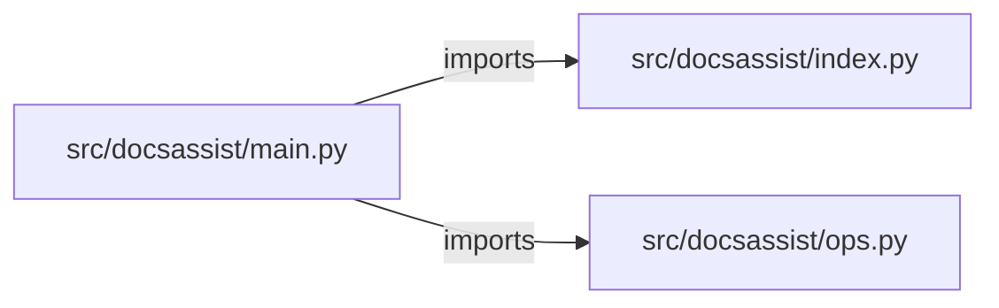

# ai-docs-assistant — project architecture

[README](README.md) · [Interview questions and answers](INTERVIEW_QA.md)

## Purpose and scope

Markdown in `corpus/` is split into chunks at each heading and blank line. Each chunk keeps its file, heading, and starting line. A question is embedded with a hashed bag of tokens and ranked against the chunks. The answer is the best chunk, with a citation such as `corpus/rollback.md:7 (Who approves)`.

This document describes files and symbols in this checkout. Deployment templates and statements in the original overview are distinguished from a verified running environment.

## Component diagram



For Python repositories, arrows show resolved local imports, not network calls or deployment order. Otherwise the diagram is a repository component map; containment arrows do not assert runtime integration.

## Components and responsibilities

| Component | Responsibility |
| --- | --- |
| [`src/docsassist/main.py`](src/docsassist/main.py) | HTTP handlers: `GET /healthz`, `POST /ask`, `GET /documents`, `POST /documents` |
| [`src/docsassist/ops.py`](src/docsassist/ops.py) | HTTP handlers: `GET /readyz`, `POST /workspaces`, `GET /workspaces`, `POST /workspaces/{workspace_id}/jobs`, `GET /jobs/{job_id}` |
| [`src/docsassist/index.py`](src/docsassist/index.py) | Functions: `tokens`, `words`, `embed`, `cosine`, `chunk`, `answer`, `flush` |
| [`requirements.txt`](requirements.txt) | Implementation or supporting configuration |
| [`Dockerfile`](Dockerfile) | Container build/service configuration |
| [`Makefile`](Makefile) | Implementation or supporting configuration |
| [`docker-compose.yml`](docker-compose.yml) | Container build/service configuration |
| [`tests/test_docs.py`](tests/test_docs.py) | Executable checks and regression examples |
| [`tests/test_ops.py`](tests/test_ops.py) | Executable checks and regression examples |
| [`.github/workflows/ci.yml`](.github/workflows/ci.yml) | GitHub Actions job definitions |
| [`README.md`](README.md) | Project explanations or operating notes |
| [`corpus/metric.md`](corpus/metric.md) | Project explanations or operating notes |
| [`corpus/refusals.md`](corpus/refusals.md) | Project explanations or operating notes |

## Existing design and operating guides

These checked-in guides provide the project’s detailed design, operational context, or deployment view:

- [`docs/ARCHITECTURE.md`](docs/ARCHITECTURE.md).

## Request interface

| Method and path | Handler | Source |
| --- | --- | --- |
| `GET /healthz` | `healthz` | [`src/docsassist/main.py`](src/docsassist/main.py#L41) |
| `POST /ask` | `ask` | [`src/docsassist/main.py`](src/docsassist/main.py#L46) |
| `GET /documents` | `documents` | [`src/docsassist/main.py`](src/docsassist/main.py#L51) |
| `POST /documents` | `add_document` | [`src/docsassist/main.py`](src/docsassist/main.py#L56) |
| `GET /readyz` | `readyz` | [`src/docsassist/ops.py`](src/docsassist/ops.py#L44) |
| `POST /workspaces` | `create_workspace` | [`src/docsassist/ops.py`](src/docsassist/ops.py#L49) |
| `GET /workspaces` | `list_workspaces` | [`src/docsassist/ops.py`](src/docsassist/ops.py#L66) |
| `POST /workspaces/{workspace_id}/jobs` | `create_job` | [`src/docsassist/ops.py`](src/docsassist/ops.py#L73) |
| `GET /jobs/{job_id}` | `get_job` | [`src/docsassist/ops.py`](src/docsassist/ops.py#L96) |
| `POST /jobs/{job_id}/approve` | `approve_job` | [`src/docsassist/ops.py`](src/docsassist/ops.py#L105) |
| `GET /audit` | `audit` | [`src/docsassist/ops.py`](src/docsassist/ops.py#L122) |
| `GET /metrics` | `metrics` | [`src/docsassist/ops.py`](src/docsassist/ops.py#L138) |

The table lists literal route decorators found in the inspected Python modules. Router prefixes and middleware can add behavior; check the linked handler and application setup before calling an endpoint.

## Implementation walkthrough

### `chunk(source, text)`

Source: [`src/docsassist/index.py`](src/docsassist/index.py#L33).

Calls visible in this function: `' '.join`, `' '.join((line.strip() for line in buffer)).strip`, `buffer.append`, `buffer.clear`, `chunks.append`, `enumerate`, `flush`, `line.lstrip`, `line.lstrip('#').strip`, `line.startswith`, `line.strip`, `text.splitlines`.

```python
def chunk(source, text):
    chunks = []
    heading = None
    buffer = []
    start = None

    def flush():
        if buffer:
            body = " ".join(line.strip() for line in buffer).strip()
            if body:
                chunks.append({"source": source, "heading": heading, "line": start, "text": body})
        buffer.clear()

    for number, line in enumerate(text.splitlines(), start=1):
        if line.startswith("#"):
            flush()
            heading = line.lstrip("#").strip()
            start = None
            continue
        if not line.strip():
            flush()
            start = None
```

The excerpt is truncated; the linked source contains the full implementation.

### `search(self, question, limit=3)`

Source: [`src/docsassist/index.py`](src/docsassist/index.py#L75).

Calls visible in this function: `cosine`, `embed`, `len`, `round`, `scored.append`, `scored.sort`, `sorted`, `words`.

```python
    def search(self, question, limit=3):
        query = embed(question)
        query_words = words(question)
        scored = []
        for item in self.chunks:
            overlap = query_words & item["words"]
            scored.append(
                {
                    "source": item["source"],
                    "heading": item["heading"],
                    "line": item["line"],
                    "text": item["text"],
                    "score": round(cosine(query, item["vector"]), 4),
                    "overlap": sorted(overlap),
                }
            )
        scored.sort(key=lambda hit: (len(hit["overlap"]), hit["score"]), reverse=True)
        return scored[:limit]
```

### `answer(self, question, limit=3)`

Source: [`src/docsassist/index.py`](src/docsassist/index.py#L94).

Calls visible in this function: `len`, `self.search`.

```python
    def answer(self, question, limit=3):
        hits = self.search(question, limit)
        if not hits or len(hits[0]["overlap"]) < MIN_OVERLAP:
            return {
                "answered": False,
                "answer": "No corpus passage is close enough. I will not answer from outside these files.",
                "citations": [],
                "passages": hits,
            }
        best = hits[0]
        citation = f"{best['source']}:{best['line']}" + (f" ({best['heading']})" if best["heading"] else "")
        return {"answered": True, "answer": best["text"], "citations": [citation], "passages": hits}
```

### `embed(text)`

Source: [`src/docsassist/index.py`](src/docsassist/index.py#L18).

Calls visible in this function: `hashlib.sha256`, `hashlib.sha256(token.encode()).digest`, `int.from_bytes`, `math.sqrt`, `sum`, `token.encode`, `tokens`.

```python
def embed(text):
    vector = [0.0] * DIM
    for token in tokens(text):
        if token in STOP:
            continue
        digest = hashlib.sha256(token.encode()).digest()
        vector[int.from_bytes(digest[:2], "big") % DIM] += 1.0 if digest[2] % 2 == 0 else -1.0
    norm = math.sqrt(sum(value * value for value in vector)) or 1.0
    return [value / norm for value in vector]
```

## Validation and failure paths

| Explicit exception | Source |
| --- | --- |
| `HTTPException(status_code=422, detail='name must be a lowercase markdown file name such as runbook.md')` | [`src/docsassist/main.py`](src/docsassist/main.py#L58) |
| `HTTPException(status_code=413, detail=f'document is over {MAX_DOCUMENT} characters')` | [`src/docsassist/main.py`](src/docsassist/main.py#L60) |
| `HTTPException(status_code=409, detail=f'the index already holds {MAX_DOCUMENTS} documents')` | [`src/docsassist/main.py`](src/docsassist/main.py#L63) |
| `HTTPException(status_code=404, detail='workspace not found')` | [`src/docsassist/ops.py`](src/docsassist/ops.py#L77) |
| `HTTPException(status_code=404, detail='job not found')` | [`src/docsassist/ops.py`](src/docsassist/ops.py#L100) |
| `HTTPException(status_code=404, detail='job not found')` | [`src/docsassist/ops.py`](src/docsassist/ops.py#L109) |
| `HTTPException(status_code=403, detail='production apply is disabled in this lab')` | [`src/docsassist/ops.py`](src/docsassist/ops.py#L113) |

These are explicit exceptions in the inspected source, rather than a claim that every failure is handled. Follow the calling handler to see whether the exception becomes an HTTP response or propagates.

## Data and state

- [`src/docsassist/index.py`](src/docsassist/index.py) defines module-level containers: `STOP`.
- [`src/docsassist/ops.py`](src/docsassist/ops.py) defines module-level containers: `_WORKSPACES`, `_JOBS`, `_AUDIT`, `_METRICS`.

Module-level dictionaries/lists live in a Python process. They can be fixtures or mutable state; inspect writes before treating them as persistent storage. A production extension would need to define persistence and concurrency behavior explicitly.

## Data flow and design decisions

### What is the input-to-output contract of `chunk`

In [`src/docsassist/index.py`](src/docsassist/index.py#L33), `chunk(source, text)` receives the inputs. The function computes these intermediate values:

- `chunks = []`
- `heading = None`
- `buffer = []`
- `start = None`

Its result is defined by:

- `chunks`

### Which decision rules or boundary conditions should an interviewer challenge

The implementation in [`src/docsassist/index.py`](src/docsassist/index.py#L33) branches on:

- `buffer`
- `line.startswith('#')`
- `not line.strip()`
- `start is None`
- `body`

A useful extension is a table-driven test that covers each condition just below, at, and above its boundary where applicable. These expressions are the current rules; changing them changes behavior and should be justified by the project’s acceptance criteria.

### What does the operations plane add, and where is its limit

[`src/docsassist/ops.py`](src/docsassist/ops.py) declares `GET /readyz`, `POST /workspaces`, `GET /workspaces`, `POST /workspaces/{workspace_id}/jobs`, `GET /jobs/{job_id}`, `POST /jobs/{job_id}/approve`, `GET /audit`, `GET /metrics`. Inspect the application’s `include_router` call for its URL prefix.

Its state containers are `_WORKSPACES`, `_JOBS`, `_AUDIT`, `_METRICS`. The job-approval handler defines whether a target is accepted or refused; check that branch and the associated tests instead of treating a recorded job as a successful infrastructure apply.

## Setup and verification

The following commands are derived from the checked-in dependency/test contracts. Execute them from the repository root; the block prepares a local environment, not a cloud deployment.

```bash
python3 -m venv .venv
source .venv/bin/activate
python -m pip install -r requirements.txt
python -m pytest -q
```

Python dependencies: [`requirements.txt`](requirements.txt).

Test entry points: [`tests/test_docs.py`](tests/test_docs.py), [`tests/test_ops.py`](tests/test_ops.py).

Automation definitions: [`.github/workflows/ci.yml`](.github/workflows/ci.yml). Read their triggers and job steps to determine what CI actually runs.

## Operating boundaries and design review

Before turning this checkout into a customer deployment, establish the input contract, data ownership, access controls, failure response, evaluation criteria, and rollback owner. Repository fixtures and unit tests demonstrate local behavior; they do not establish throughput, uptime, compliance, or business impact.

A useful architecture review starts with the linked implementation: identify where input enters, where a decision is made, which state can change, and which external dependency can fail. Add a deployment view only for infrastructure that is actually configured and exercised.
